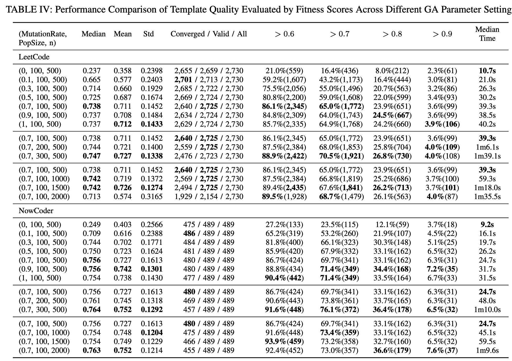
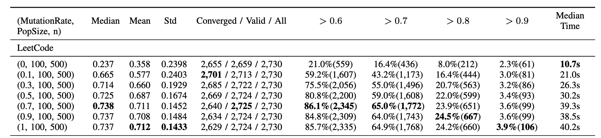
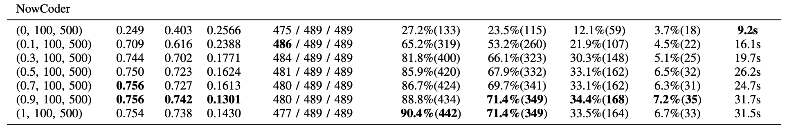
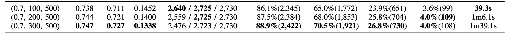
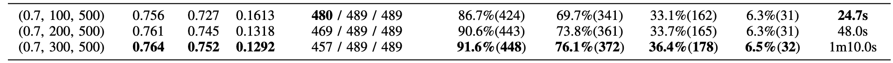
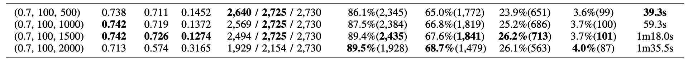
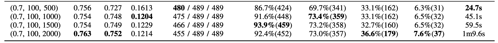
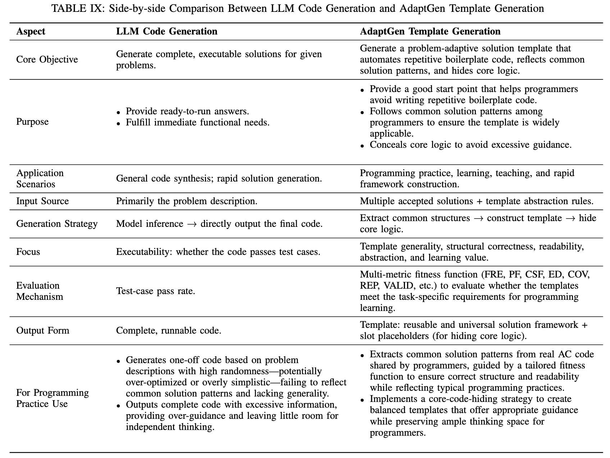
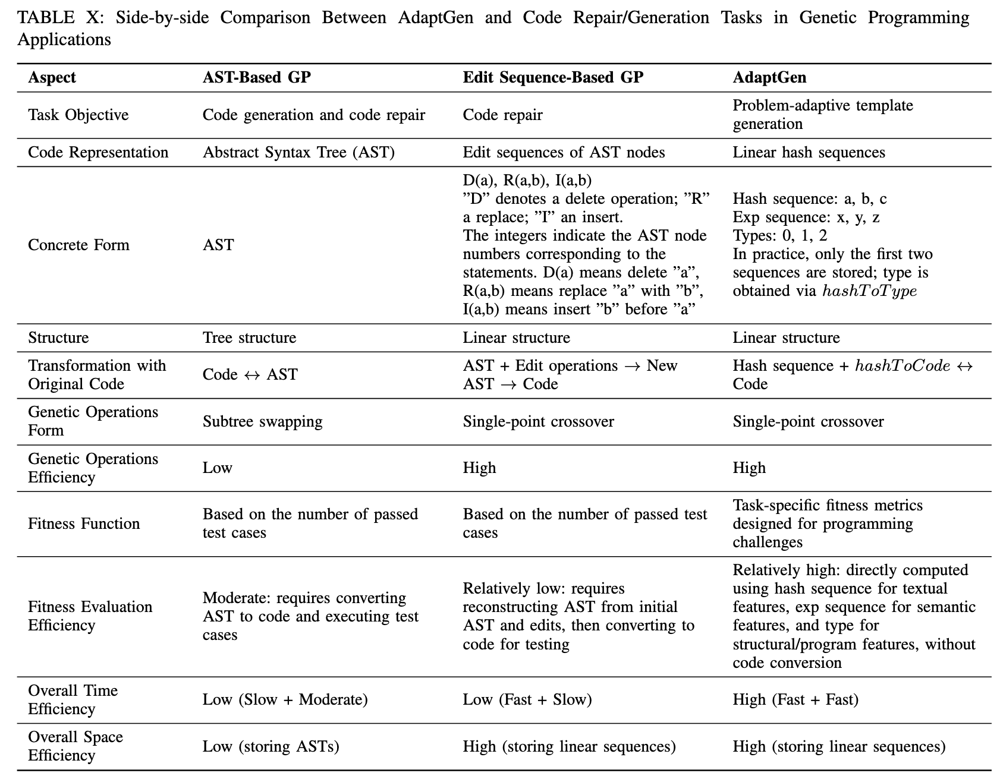

## Quick Navigation

- [AdaptGen](#adaptgen)
  - [Key Features](#key-features)
  - [Datasets](#datasets)
  - [Evaluation Results](#evaluation-results)
  - [Project Components](#project-components)
- [Setup](#setup)
  - [Prerequisites](#prerequisites)
  - [Environment Setup](#environment-setup)
- [How to Use AdaptGen](#how-to-use-adaptgen)
- [Acknowledgements](#acknowledgements)
- [Contact](#contact)
- [Appendix](#appendix)
  - [Detailed Evaluation Methods for RQ2](#detailed-evaluation-methods-for-rq2-how-well-do-the-solution-templates-generated-by-adaptgen-meet-the-various-template-requirements-)
  - [Sensitivity Analysis](#sensitivity-analysis)
  - [Side-by-Side Fine-Grained Comparison Tables](#side-by-side-fine-grained-comparison-tables)

## AdaptGen

AdaptGen is a problem-adaptive solution template generation method for online programming platforms. It analyzes and extracts problem-solving patterns from various programming problems' solutions and generates solution templates tailored to each problem. The templates contain only the basic algorithm structure and necessary boilerplate code, leaving the core logic for programmers to complete.

### Key Features

- **Genetic Programming-Based Solution Template Generation**: Utilizes genetic programming to generate solution templates for coding tasks.
- **Efficient Encoding Strategy**: A linear hashing sequence encoding strategy is used for solution representation.
- **Evolutionary Operators**: Selection and crossover operators with de-duplication, random crossover, and stratified selection to maintain diversity.
- **Custom Fitness Function**: Directs the evolutionary process towards effective solution templates.
- **Semantic Abstraction and Core Code Concealment**: Transform evolved solutions into final templates by abstracting semantic elements and hiding core code.

### Datasets

Two datasets were constructed from popular platforms:

- **LeetCode**: 841 programming tasks with a total of 2,730 categories.
- **NowCoder**: 156 programming tasks with a total of 489 categories.

### Evaluation Results

- **Template Generation Qualification Rate**: 77%-85%
- **Applicability Rate**: 80%
- **Coding Efficiency Improvement**: 60% (based on edit distance)

### Project Components

- **`datasets/`**: Contains datasets from LeetCode and NowCoder for evaluation. 
- **`py/`**: Python scripts for analyzing the results of RQ1 (Research Questions).
- **`src/main/java/evalute/`**: Java classes for evaluating AdaptGen's performance on different research questions.
- **`src/main/java/realize/`**: Implementation of core components such as encoding, fitness calculation, genetic algorithm (GA) operations, preprocess, and utility functions.
- **`pom.xml`**: Maven configuration file for managing dependencies and building the project.

## Setup

### Prerequisites

- **Java 17**: Ensure you have Java installed on your system.
- **Maven**: For building and managing project dependencies.
- **Python 3.x**: For running Python scripts for result analysis.
- **Python Libraries**: Install necessary libraries.
- **IDE:** IntelliJ IDEA, Eclipse, or any other IDE that supports Maven projects.

### Environment Setup

To set up the project in IntelliJ IDEA and manage dependencies with Maven:

1. **Open IntelliJ IDEA**:
   - Start IntelliJ IDEA and select **"Open"** from the Welcome screen or **"File > Open..."** if you already have another project open.

2. **Import the Project**:
   - Navigate to the root directory of the `AdaptGen` project that you cloned.
   - Select the project directory and click **"Open"**.

3. **Import Project from Maven**:
   - If IntelliJ IDEA detects a Maven project, it will automatically configure it for you. 
   - If not, go to **"File > Project Structure > Project"**, and set the **Project SDK** to the appropriate version of Java (JDK 17).

4. **Download Dependencies**:
   - IntelliJ IDEA should automatically start downloading the dependencies defined in the `pom.xml` file. If it doesn't, you can manually trigger it:
     - Open the **"Maven"** tool window from the right sidebar.
     - Click on the **"Reload All Maven Projects"** button (two arrows forming a circle).

5. **Build the Project**:
   - Once the dependencies are downloaded, you can build the project by clicking **"Build > Build Project"** from the top menu or using the shortcut **`Ctrl+F9`**.

6. **Run the Main Class**:
   - Locate the main class under `src/main/java/evalute/Main.java` or any other main class you want to execute.
   - Right-click on the file and select **"Run 'Main'"** to run the project.

7. **Verify the Setup**:
   - Ensure that all dependencies are resolved without errors, and the project builds successfully.

### How to Use AdaptGen

1. **Prepare the Dataset**: Ensure you have the datasets ready in the `datasets/` directory.

2. **Generate Solution Templates**:  
   If you want to generate solution templates for programming problems, place the Accepted (AC) code corresponding to the programming problem in the `datasets` folder following the format of the existing files. Alternatively, you can write your own code to call the `start` function in `GAStart` to generate templates programmatically.

3. **Evaluate and Refine**: Use the provided scripts and classes to evaluate the quality of the generated templates and refine the parameters for better results.

## Acknowledgements

- **LeetCode and NowCoder**: For providing the programming tasks and solution data.

## Contact

For questions, please contact the project maintainers at [zhangguowei@nuaa.edu.cn].

## Appendix

### Detailed Evaluation Methods for RQ2 (How Well Do the Solution Templates Generated by AdaptGen Meet the Various Template Requirements) ?

 The specific scoring criteria we referred to during manual evaluation are as follows.

**(1) Inclusion of common code statements:** This evaluates the proportion of missing common code within a template in relation to its total length. To quantify this, we first manually identified common code statements (such as loop statements, condition statements, initialization statements, etc.) from all AC code of a solution category. Then, we count the number of common code that are missing in the template and divide it by the total code lines of the template; the obtained ratio is used to measure the extent of common code missing from the template. The ratios are categorized into four levels: A: < 5%, B: < 15%, C: < 30%, D: > 30%, where a lower percentage signifies better inclusion of common statements. A statistical analysis is then conducted on the distribution of these levels.

**(2) Capture of the algorithm’s basic structure:** This evaluates the statement proportion of a template that requires adjustment to align with the algorithm’s basic structure. Specifically, it examines whether the template correctly combines essential structural components that are common to all AC code, such as loop blocks, conditional blocks, and function blocks. This process involves examining the structure of all AC code to identify the common algorithmic structure, followed by comparing the generated template with this common structure. The comparison includes checking the position of common components, as well as the frequency and order of different types of statements within the code blocks. The level of required adjustments is classified into four categories: A: < 5%, B: <15%, C: < 30%, D: > 30%. The fewer changes needed, the better the template captures the algorithm’s structure. The distribution of these levels is then statistically analyzed.

**(3) Free from incorrect repetition:** This evaluates the proportion of incorrect redundant code within the template. Redundancy is identified by examining repeated code statements in the template and determining whether they appear multiple times in the AC code. The results are classified into four levels and then subjected to statistical analysis. The scoring is as follows: A: < 5%, B: < 15%, C: < 30%, D: > 30%. A lower percentage indicates a more correct template.

**(4) Good readability with well-layered structure and consistent naming:** A template with good readability basically should ensure a well-layered structure and consistent identifier naming. Abou this, we first reviewed a template to check whether it follows a well-layered code structure. Then, we checked the inconsistencies between the naming and usage of identifiers and calculated the proportion of inconsistent statements against all statements of the template. The results are classified as: A: Structure correct and < 5% inconsistent naming, B: Structure correct and < 25%, C: Structure correct and < 40%, D: Structure incorrect or > 40% (both cases in D level generally lead to a template with bad readability). Lower levels (e.g., A) indicate better readability.

**(5) Proper hiding of core code statements:** This evaluates the proportion of core code present in the template. We manually examined each line of the solution template to determine whether it qualified as core code. Specifically, we assessed whether the code included problem-solving logic or computational operations, and whether it left space for developer creativity. Following this, we calculated the proportion of core code relative to the total length of a solution template. The results are classified into four categories: A: < 5%, B: < 15%, C: < 30%, D: > 30%. Lower percentages indicate a better hiding of core code.

**(6) Overall quality:** This evaluates a template’s overall quality by determining the extent of adjustments required to make it usable. Specifically, we first manually constructed an ideal template for each solution category, guided by the above-mentioned standards. Then, we compared each template generated by AdaptGen against the ideal template to identify how many code statements should be adjusted so that the generated template could be transformed into the ideal template. Last, we calculate the proportion of such adjustments required relative to the ideal template. The scoring criteria are as follows: A: < 5%, B: < 25%, C: < 40%, D: > 40%.

------

### Sensitivity Analysis

The GA parameter set used in our experiments was initially tuned on a small-scale dataset to balance solution quality and evolutionary efficiency, and was later found to perform well on the full dataset. This prompted us to conduct a sensitivity analysis on the complete LeetCode and NowCoder datasets to better understand the influence of individual parameters and to explore potentially better configurations.

We adopted a control-variate strategy: two parameters were held fixed while the third was varied. We also ran each parameter setting under the same experimental environment (including re-running the previously used setting of 0.7, 100, 500). This allowed us to isolate and examine the individual effect of each parameter.

In terms of evaluation metrics, the convergence performance of the genetic algorithm was assessed using the proportion of converged categories. For categories that did not converge within 10 minutes, the best individual from the final population was still recorded as a valid result, together with converged outcomes. Categories failing due to memory exhaustion or stack overflow were considered invalid. The ratio of valid results reflects the operational stability of AdaptGen. We further evaluated overall solution quality based on fitness scores, where invalid results were assigned zero. The median, mean, and standard deviation of these scores were reported. The proportion of valid results surpassing fitness thresholds of 0.6, 0.7, 0.8, and 0.9 was also analyzed to gauge the ability to generate solutions at different quality tiers. Efficiency was measured as the median time per valid result across all categories. These metrics together offer a multi-faceted view of how each parameter affects the behavior of AdaptGen.

#### Mutation Rate

With population size fixed at 100 and termination criterion $n=500$, mutation rates ranging from 0 to 1 (0, 0.1, 0.3, 0.5, 0.7, 0.9, 1) were evaluated (see Table IV, first section for LeetCode, fourth section for  NowCoder).

**LeetCode Results**: Without mutation (rate = 0), AdaptGen exhibits severe premature convergence, yielding a low median fitness of 0.237, a mean of 0.358, and only 21.0% and 8.0% of templates exceeding the 0.6 and 0.8 thresholds, respectively. As the mutation rate increases, performance improves consistently. At a rate of 0.7, the median fitness reaches 0.738, with strong threshold performance: 86.1% > 0.6 and 65.0% > 0.7. Both the converged and valid rates remain high (96.7% and 99.8%). Beyond 0.7, improvements become marginal; for instance, at rate 0.9, the median remains at 0.737, and the mean slightly decreases to 0.708. Computation time remains similar within 38-40s for rates 0.7-1.0, indicating no advantage in further increasing the rate. Therefore, on the LeetCode dataset, considering all performance and efficiency metrics, a mutation rate of 0.7 is sufficient and achieves the best overall performance.

**NowCoder Results**: The evaluation reveals a highly similar trend. The performance improves substantially with the introduction and increase of mutation rate, and plateaus after reaching 0.7. The key difference lies in the observation that on NowCoder, increasing the mutation rate from 0.7 to 0.9 yields an improvement in the mean fitness (from 0.727 to 0.742) and in the percentage of solutions above the 0.6 and 0.7 thresholds. However, this comes with a noticeable increase in runtime (from 24.7s to 31.7s). The median fitness remains stable at the high level of 0.756 for rates 0.7 and 0.9. Therefore, for the NowCoder dataset, a mutation rate of 0.9 is the optimal choice, whereas 0.7 offers faster efficiency while still achieving satisfactory quality.

**Conclusion**: Across both datasets, a mutation rate of 0.7 is the most effective setting, consistently producing high-quality results with a good efficiency trade-off.

#### Population Size

Fixing the mutation rate at 0.7 and $n=500$, we compared population sizes of 100, 200, and 300 (see Table IV, second section for LeetCode, fifth section for  NowCoder).

**LeetCode Results**: Increasing the population size improves fitness, with the median rising from 0.738 (size 100) to 0.747 (size 300), and the proportion of solutions above 0.6 increasing from 86.1% to 88.9%. However, the number of converged solutions decreases from 2,640 to 2,476 as the population grows. This is because larger populations require more computational resources per iteration, increasing the time needed for each evolutionary round, leading to more records failing to converge within the 10-minute time limit. The computation time increases substantially: from 39.3s (size 100) to 1m 39.1s (size 300).

**NowCoder Results**: The same trend is observed. Larger populations lead to improved fitness, with the median rising from 0.756 (size 100) to 0.764 (size 300). However, this comes at the cost of longer runtime and a lower number of converged solutions.

**Conclusion**: Across both datasets, while larger populations improve fitness, the gains do not justify the significant increase in computational cost. Therefore, a population size of 100 offers the best efficiency-performance trade-off for AdaptGen.

#### Termination Criterion

With mutation rate = 0.7 and population size = 100, termination criteria of $n=500$, 1000, 1500, and 2000 were tested (see Table IV, third section for LeetCode, sixth section for  NowCoder).

**LeetCode Results**: Extending $n$ from 500 to 1500 leads to fitness improvements: the median increases from 0.738 to 0.742, and the proportion of solutions above 0.6 rises from 86.1% to 89.4%. However, runtime more than doubles from 39.3s to 1m18.0s. At $n=2000$, performance degrades significantly: the median fitness drops to 0.713, and the number of valid results decreases to 2,154 (out of 2,730). This decline in valid results consequently lowers the overall fitness values, likely due to insufficient system resources from excessive evolution cycles. Notably, our results indicate that AdaptGen’s performance could improve with more powerful computational resources. The current best mean fitness (0.726) and high-threshold performance (26.2% > 0.8) are achieved at $n = 1500$, even with some unconverged cases due to time constraints. With better hardware and extended time limits, it could search more effectively, potentially yielding even better performance. Furthermore, the $n = 2000$ configuration would likely overcome current resource limitations to produce more valid results with enhanced performance.

**NowCoder Results**: The dataset demonstrates a consistent improvement trend as $n$ increases. Extending $n$ from 500 to 2000 leads to steady enhancements: the median fitness rises from 0.756 to 0.763, the mean fitness improves from 0.727 to 0.752, and the proportion of solutions above the 0.8 threshold increases from 33.1% to 36.6%. However, the converged results decrease from 480 to 455 as $n$ increases, due to the fixed time limit. The runtime shows a near-linear growth pattern, increasing from 24.7s ($n=500$) to 1m9.6s ($n=2000$).

**Conclusion**: Considering fitness quality and computational cost, the optimal termination criterion is $n=500$ for our current experimental setup, achieving strong performance with reasonable runtime. For scenarios with more abundant computational resources, setting $n = 1500$ or higher can yield better solution quality.

#### Experimental Results Summary

Based on systematic experiments across LeetCode and NowCoder datasets, we determine the optimal parameters for AdaptGen: **mutation rate 0.7, population size 100, and termination criterion n=500**, providing the best efficiency-quality trade-off under constrained resources. When more resources are available, increasing population size or extending $n$ can further enhance solution quality, demonstrating AdaptGen's adaptability to diverse computational scenarios.

------

### **Side-by-Side Fine-Grained Comparison Tables**

